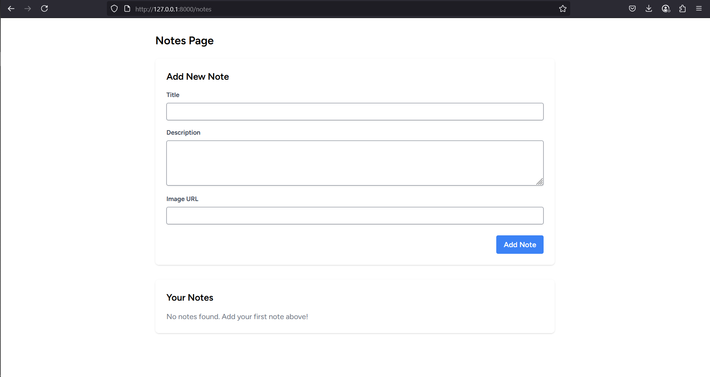
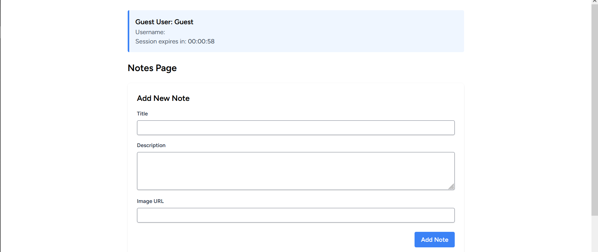
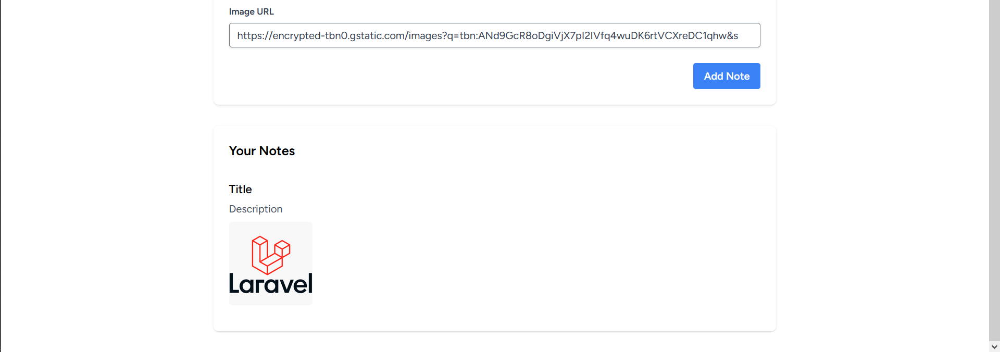

# 📝 Todo Note App with Laravel + Inertia (React)

A simple note-taking application built with Laravel and Inertia.js with React with session integrated.

## ✨ Tech Stack

-   **Laravel** 12+
-   **PHP** 8.2+
-   **Inertia.js** with React
-   **MySQL** (or your preferred database)
-   **Node.js** (for frontend dependencies)

## ⚙️ Environment Setup

Update your `.env` file with these key configurations:

````ini
DB_DATABASE=note
SESSION_DRIVER=database
SESSION_LIFETIME=1

Session lifetime could be any minute like 10 but for testability it is better to use 1

## 🚀 How to Run This App (Step by Step)

### ✅ Step 1: Clone the repository

```bash
git clone https://github.com/aimandesu/note-laravel-inertiajs.git
cd note-laravel-inertiajs
composer install
npm install
php artisan migrate:fresh --seed
````

### ✅ Step 2: Run the application

```bash
npm run dev
php artisan serve
```

Find your localhost from php artisan serve terminal it should be listed
then go to any browser and do localhost/notes
for example: http://127.0.0.1:8000/notes

## App Preview

### Screenshots

<div style="display: flex; gap: 10px; flex-wrap: wrap;">
  
  
  
</div>
